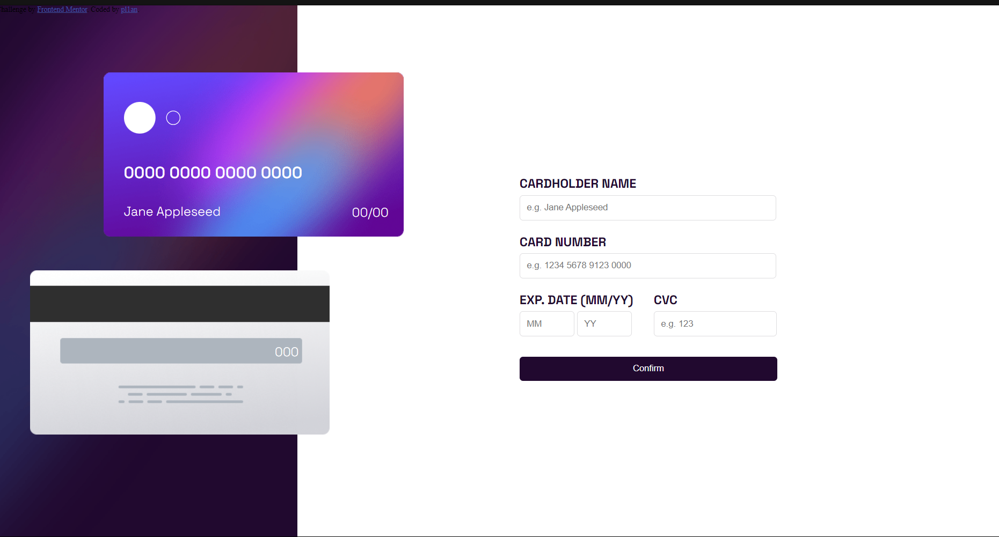
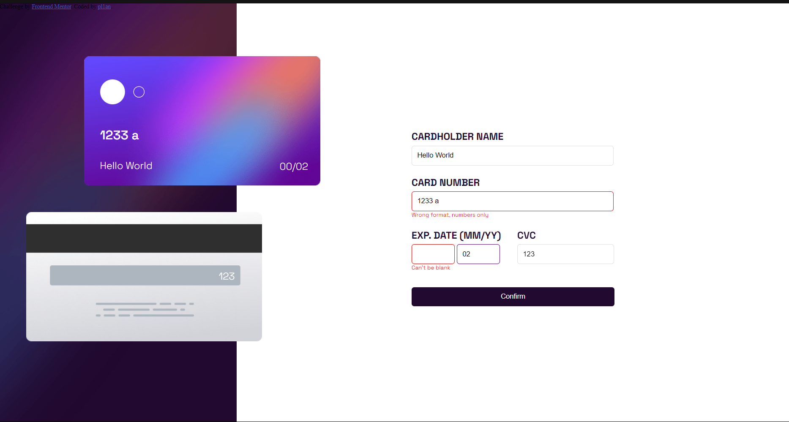
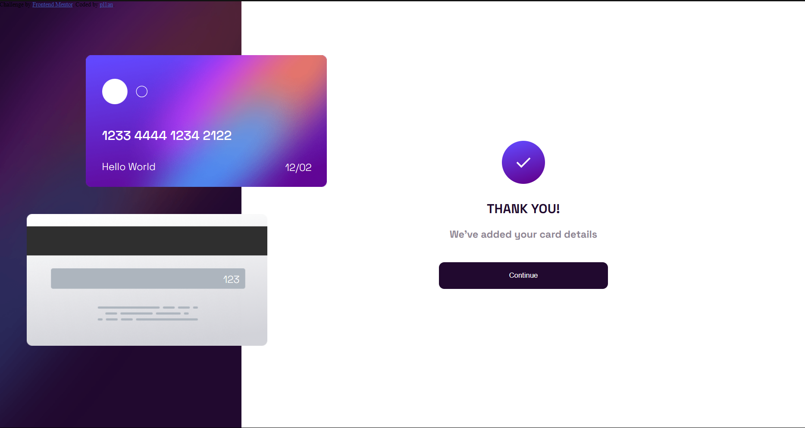

# Frontend Mentor - Interactive card details form solution

This is a solution to the [Interactive card details form challenge on Frontend Mentor](https://www.frontendmentor.io/challenges/interactive-card-details-form-XpS8cKZDWw). Frontend Mentor challenges help you improve your coding skills by building realistic projects. 

## Table of contents

- [Overview](#overview)
  - [The challenge](#the-challenge)
  - [Screenshots](#screenshots)
- [My process](#my-process)
  - [Built with](#built-with)
  - [What I learned](#what-i-learned)
  - [Continued development](#continued-development)
  - [Useful resources](#useful-resources)
- [Author](#author)
- [Acknowledgments](#acknowledgments)

## Overview

### The challenge

Users should be able to:

- Fill in the form and see the card details update in real-time
- Receive error messages when the form is submitted if:
  - Any input field is empty
  - The card number, expiry date, or CVC fields are in the wrong format
- See active, and focus states for interactive elements on the page

### Screenshots





## My process

### Built with

- Semantic HTML5 markup
- CSS custom properties
- Flexbox
- Vanilla JavaScript
- [Styled Components](https://styled-components.com/) - For styles

### What I learned

Before going into this project, my JavaScript knowledge was sparse. While i still have much to improve, coding this challenge gave a better understanding about a lot of JavaScript's features when dealing with CSS and HTML code.

I learned how to use document.querySelector() to get elements from my HTML code.
```js
const form = document.querySelector(".form-place");
const end_form = document.querySelector(".activated-card");
```

I also learned how to deal with eventListeners and how to add them to inputs and buttons to code the necessary actions for the objective of the document.
```js
name_input.addEventListener("keydown", (e) =>{
    keyboard_listener(e, name_input, name_text, "Jane Appleseed", 28, false);
})
number_input.addEventListener("keydown", (e) =>{
    keyboard_listener(e, number_input, number_text, "0000 0000 0000 0000", 19, true);
})
cvc_input.addEventListener("keydown", (e) =>{
    keyboard_listener(e, cvc_input, cvc_text, "000", 3, true);
})
month_input.addEventListener("keydown", (e) =>{
    keyboard_listener(e, month_input, month_text, "00", 2, true);
})
year_input.addEventListener("keydown", (e) =>{
    keyboard_listener(e, year_input, year_text, "00", 2, true);
})
```

And finally, i learned how to change CSS styles using JavaScript code.
```js
if(type_error || empty_error) target.style.border = "1px red solid";
if(!type_error && !empty_error) target.style.removeProperty("border");
```

### Continued development

Overall, this challenge made me realize that i am still only a beginner when it comes to front-end development. I caught myself having troubles with a few of the basic Vanilla JavaScript features and having to browse internet for solutions.

But it was also a really fun experience.

I hope to learn more about JavaScript to a point where i don't struggle with challenges like these. Specially about how to deal with eventHandlers in the code.

### Useful resources

- [Stack overflow](https://stackoverflow.com/questions/2155737/remove-css-class-from-element-with-javascript-no-jquery) - This helped me to change dynamically the borders around the input areas. 
- [Element: Keydown Event](https://developer.mozilla.org/en-US/docs/Web/API/Element/keydown_event) - This is an amazing article which helped me understand how to work with key presses and update dynamically the card image.

## Author

- My github - [pl1an](https://github.com/pl1an)
- Frontend Mentor - [@yourusername](https://www.frontendmentor.io/profile/yourusername)

## Acknowledgments

Once again, thank you iJunior for making me interested in front-end development in first place. Without the trainee program, i wouldn't be here right now.
