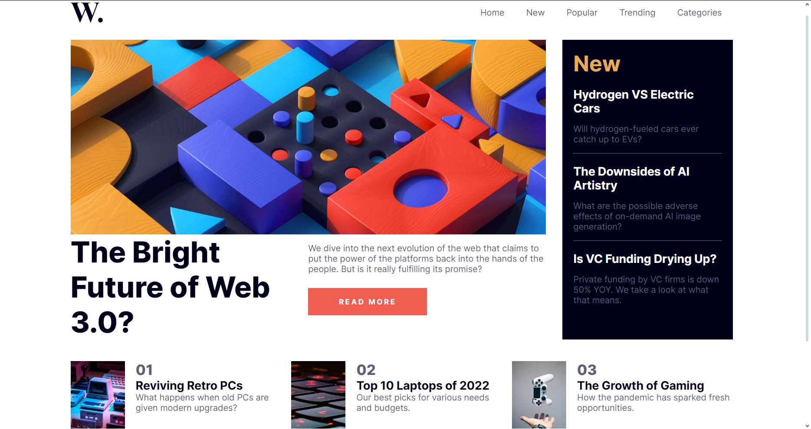

# Frontend Mentor - News homepage solution

This is a solution to the [News homepage challenge on Frontend Mentor](https://www.frontendmentor.io/challenges/news-homepage-H6SWTa1MFl). Frontend Mentor challenges help you improve your coding skills by building realistic projects. 
  
## Table of contents

- [Overview](#overview)
  - [The challenge](#the-challenge)
  - [Screenshot](#screenshot)
  - [Links](#links)
- [My process](#my-process)
  - [Built with](#built-with)
  - [What I learned](#what-i-learned)
- [Author](#author)
- [Acknowledgments](#acknowledgments)
  
## Overview
  
### The challenge

Users should be able to:

- View the optimal layout for a generic desktop dysplay
- See hover states as shown in **active-states.jpg**.
  
### Screenshot


  
### Links

- Solution URL: [Add solution URL here](https://your-solution-url.com)
- Live Site URL: [Add live site URL here](https://your-live-site-url.com)
  
## My process
  
### Built with

- Semantic HTML5 markup
- CSS custom properties
- Flexbox
  
### What I learned

Using a general border for every div in the html for visualization is a really good practice.
It helped me with the visualization of divs through the whole challenge
```css
*{border: 1px red solid;}
```
  
Its also the first time i tried working with porcentages in CSS, and i really enjoyed it.
Even though i ended up having a few problemns with aligning every div in the page correctly.
```css
.readmore{
    padding-right: 2.5%;
    display: flex;
    flex-direction: column;
    justify-content: center;
}
```
  
I feel like i depend a little bit too much of divs when coding the HTML structure of the page.
It didn't coused me any trouble, but the HTML code doesen't looks good and it's hard to read.
I'm going to search for alternatives.
```html
<div class="readmore">
      
      <div class="moretext">
        <h1>The Bright<br>Future of<br>Web 3.0?</h1>
        <div>
          <p>We dive into the next evolution of the web that claims to put the power of the platforms back into the hands of the people. 
            But is it really fulfilling its promise?</p>
          <button>Read more</button>
        </div>
      </div>
    </div>
```
  
I also need to learn more about how to work correctly with fonts and font-familys.
```css
@font-face {font-family: "Inter"; src: url(assets/fonts/static/Inter-Regular.ttf);}
@font-face {font-family: "InterBold"; src: url(assets/fonts/static/Inter-Bold.ttf);}
@font-face {font-family: "InterExtra"; src: url(assets/fonts/static/Inter-ExtraBold.ttf)}
```
  
## Author

- Frontend Mentor - [@pl1an](https://www.frontendmentor.io/profile/pl1an)

## Acknowledgments

Thank you iJunior, for guiding me through the first trainee weeks as a front-end developer.
Without you guys, i probably wouldn't be here right now.

