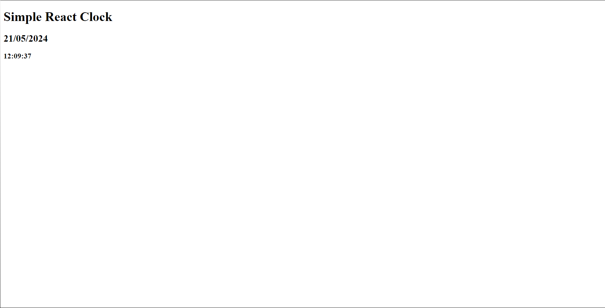
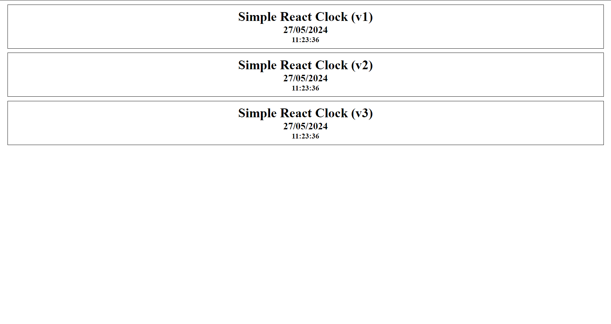

# A simple react clock

## Intro
- This is a simple "project" to test react functionalities and resources.
- It will be updated constantly while im learning react with the objective to test features.

## Features
- **(v1)** User should be able to: View a simple clock with no page style, that registers current time and date.
- **(v2)** User should be able to: View 3 simple clocks with a simple CSS style showing current time and date in synchrony.

## Made with
- Java Script React
- HTML
- Vite

## Future updates
- This is a placeholder project with the objective to test new features from react when i learn them. Because of this, the project isn't going to remain a simple clock forever, since new features are going to be constantly added.
- My main objective right now is to learn how to use *state* since using *render* every clock tick is not optimal.
- New objects and features will be constantly added to this README.
- With the *state* clock added (third one from top in the page) now i will focus my studies on understanding *forms* with react, and how to receive and treat inputs.
- Next update will probably contain a clock where you can choose the current date or region.

## Page state history

## Made by
- [pl1an](https://github.com/pl1an)

